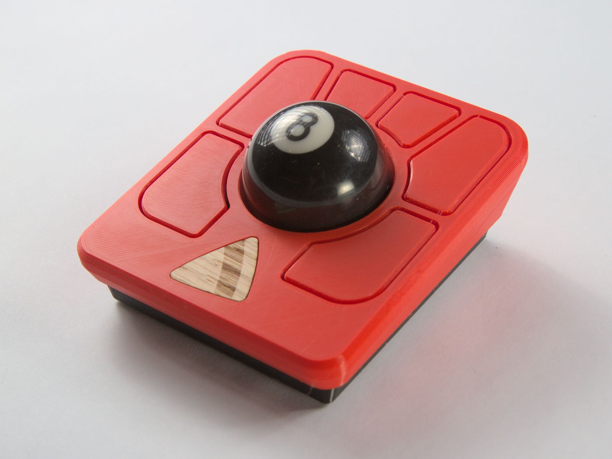

# The Ploopy Adept Trackball

By some stroke of luck, you've made your way here. The Ploopy Adept Trackball. Your life will never be the same.

This repository contains all of the design and production files necessary to make a Ploopy Adept Trackball. We've also included some [kick-ass documentation](https://ploopyco.github.io/adept-trackball) on how to get it made, assemble it, and program it.

What are you waiting for? Your new life awaits.

## QMK?!

Kits bought from the [Ploopy store](https://ploopy.co/product-category/trackball/adept/) come with QMK and VIA preloaded. [Check out the Wiki](https://ploopyco.github.io/adept-trackball) for instructions on how to load new firmware onto your device. (It's super easy!)

The firmware hex file that ships with all Adepts is included in this repository as well, as `ploopyco_madromys_rev1_001_via.uf2`.

## Under what license is this released?

As per QMK's licensing requirements, the firmware for the Ploopy Adept Trackball is released under GPLv3. Hardware design files, including electronics and mechanical files, are released under OHL CERN v2-S. Check the respective directories for full license text.
