

## Step 1: Prepare necessary tools

  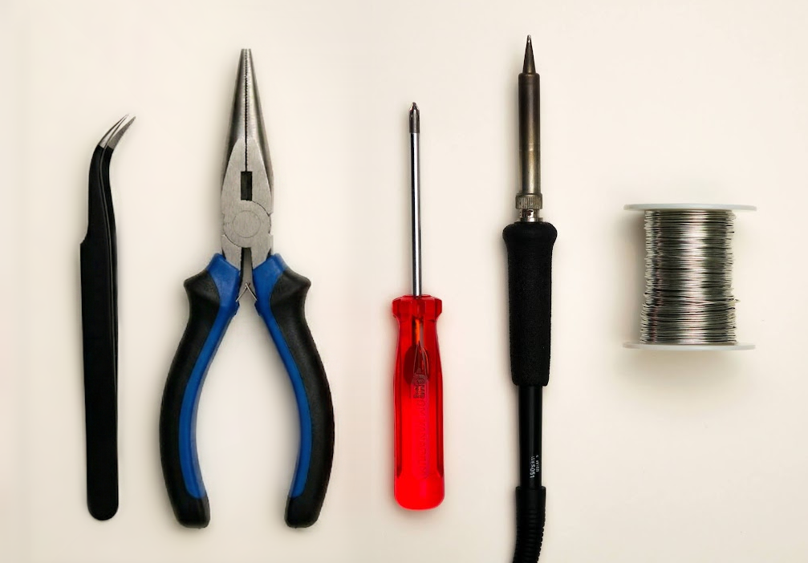

- A #1 Phillips head screwdriver
- Soldering iron
- Solder
- Optional: tweezers
- Needle-nose pliers

  💡
  

    <strong>Tip:</strong> A similar smallish Phillips head screwdriver could work.
  

## Step 2: Break off possible leftover tabs off the PCB
- There are up to six possible small tabs along the edge of the PCB as shown in the picture.
- Holding the PCB as pictured, gently break off any tabs using a pair of pliers.

  🚨
  

    <strong>Warning:</strong> These tabs should come off relatively easily, don’t use excessive force, it probably means you are doing it wrong!
  

  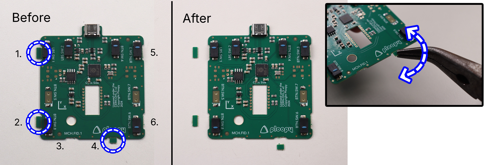

## Step 3: Prepare parts for PCB soldering

Prepare the following components as pictured below:

- Printed circuit board
- PMW-3360 chip

  💡
  

    <strong>Tip:</strong> The PMW-3360 chip will come in a small piece of foam. Go ahead and remove it now.
  

  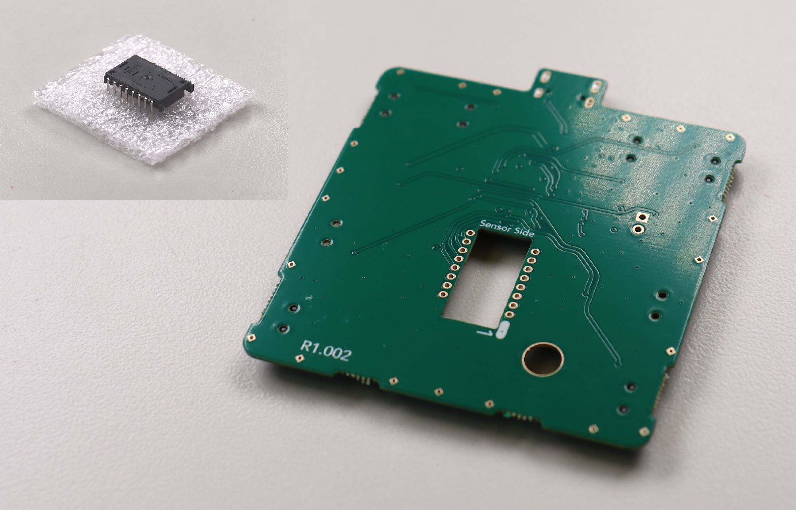

## Step 4: Solder PMW-3360 sensor to printed circuit board

- Place the sensor onto the circuit board, ensuring the orientation is correct.

  🚨
  

    <strong>Warning:</strong> Use the cues presented in the following images to ensure the sensor is oriented correctly.
  

  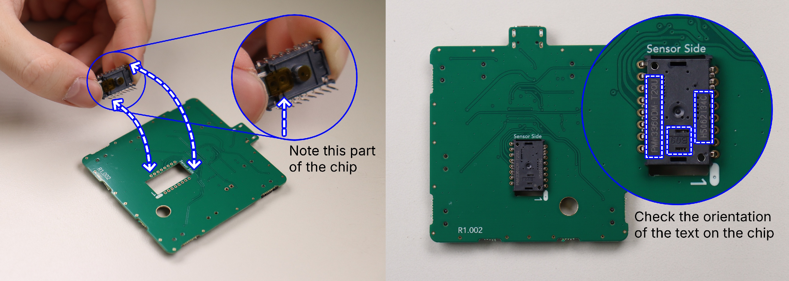

  🚨
  

    <strong>Warning:</strong> The sensor must be flat down as far as it can possibly slide into the holes before soldering.
  

  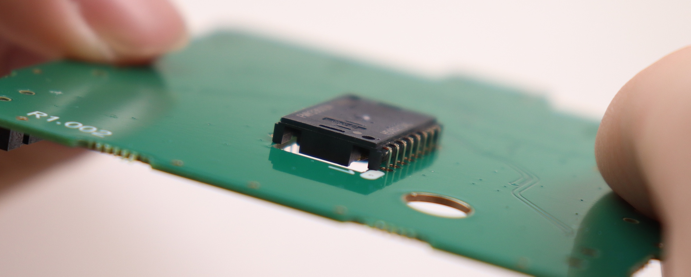

## Step 5: Remove the tab of kapton tape on the PMW-3360 chip

  💡
  

    <strong>Tip:</strong> Try to do this step in a dust-free environment.
  

- There are two small tabs of orange tape covering the sensor's main holes. Remove them now.

  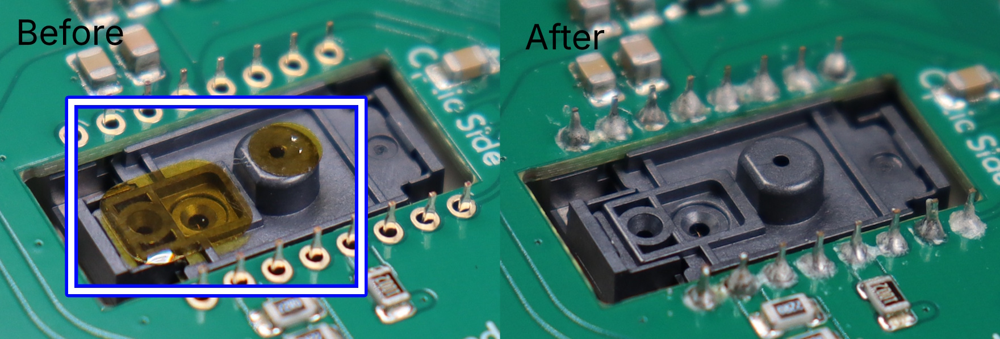

  ℹ️
  

    <strong>Info:</strong> Check your solder joints during this step to ensure that they are good. To know if they are good, consult the
    <a href="https://help.ploopy.co/?docs=ive-soldered-my-kit-together-but-the-parts-i-soldered-dont-work-2" style="color: #004085; font-weight: bold; text-decoration: underline;">soldering FAQ</a>.
  

## Step 6: Attach the PMW-3360 optic to the PMW-3360 chip

- Orient the optic as shown in the image before insertion.

  🚨
  

    <strong>Warning:</strong> It should NOT require any force to insert fully; if it does, remove it and check the orientation before trying again.
  

  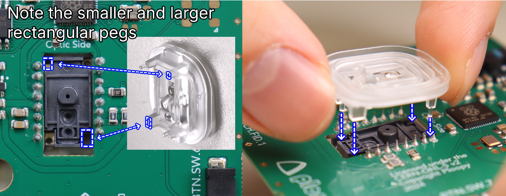

## Step 7: Place the PCB into the Base

- This should be straightforward, the PCB should fit exactly as shown.

  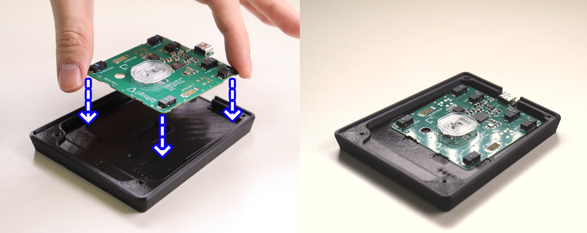

## Step 8: Place the Sensor Cap on the PCB

- Place the sensor cap on the PCB as shown in the image.

  💡
  

    <strong>Tip:</strong> The Sensor Cap doesn't snap onto the PMW-3360 optic. It "floats" on top of the optic for now. Once fully assembled, the Sensor Cap will be securely held down.
  

  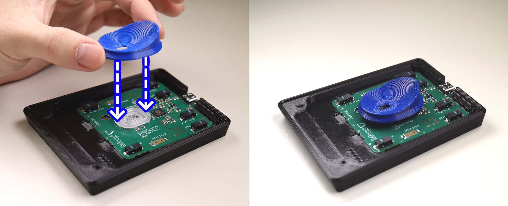

## Step 9: Place the Top Piece onto the Base Piece

- Place the top onto the base.

  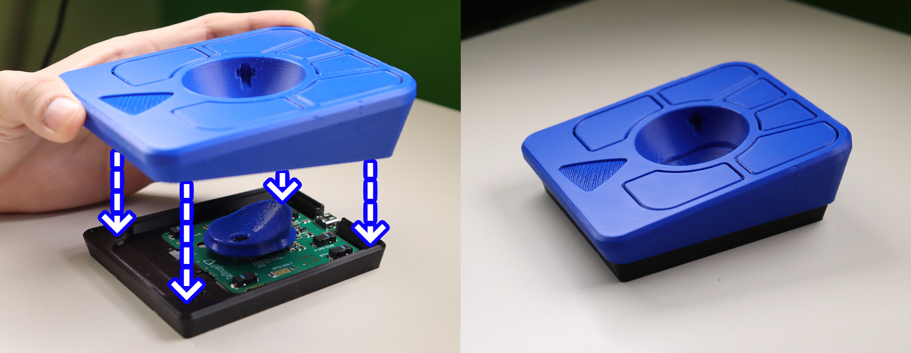

  💡
  

    <strong>Tip:</strong> If necessary, adjust the position of the Sensor Cap as you're lowering the Top onto the Base. It should end up looking like the image.
  

  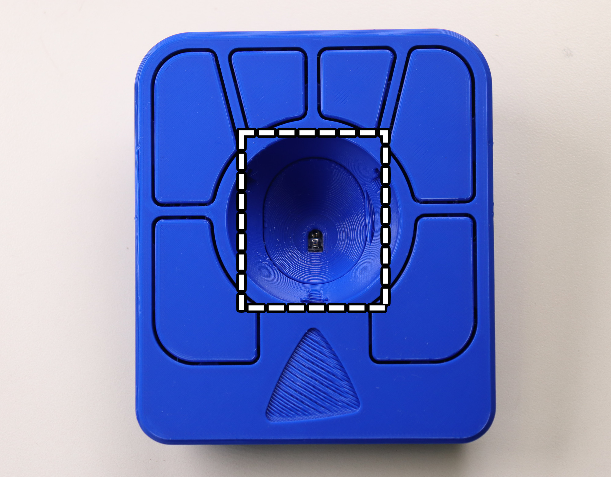

## Step 10: Screw the Base into the Top

  💡
  

    <strong>Tip:</strong> You are safe to flip the frame upside down for this and future steps.
  

- Slowly drive the screws into the four holes in the top until you feel resistance.

  🚨
  

    <strong>Warning:</strong> Only screw until the frame feels firmly together. If you use too much force, you may break the frame.
  

  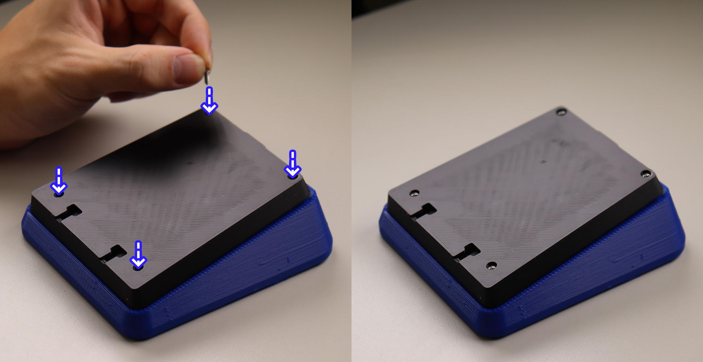

## Step 11: Prepare Roller Bearing Parts

- 3x Roller Bearing
- 3x Roller Bearing Dowel
- Bearing Press Jig (Taller Half + Shorter Half)

  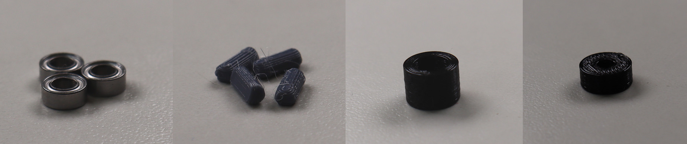

## Step 12: Insert Roller Bearing and Bearing Dowel into Bearing Press Jig

- Insert the bearing into the taller half of the bearing press jig.

  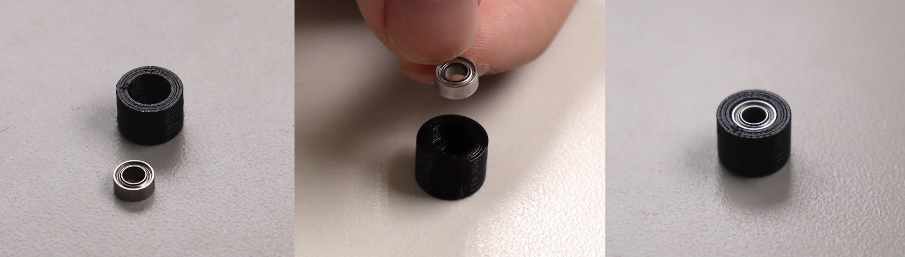

- Insert dowel into the shorter half of the bearing press jig.

  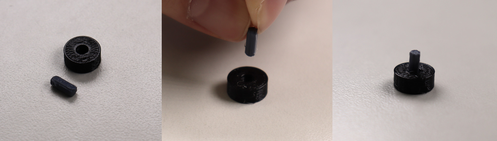

## Step 13: Press the Bearing Jig Together

- Press the bearing press jig together.

  🚨
  

    <strong>Warning:</strong> This may require a surprising amount of force; try your best not to bend the roller bearing dowel. If you do, there are spares included in the assembly kit.
  

  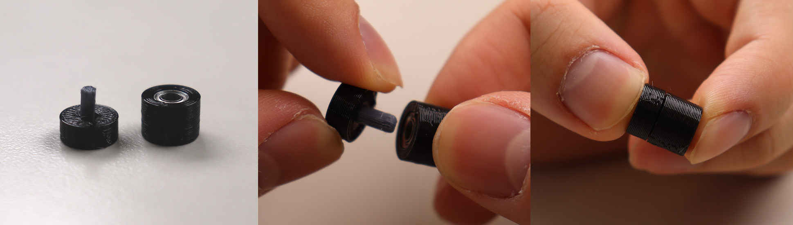

## Step 14: Remove roller bearing from bearing press jig and repeat

- Remove the the roller bearing from the press jig.
- Repeat 3 times to end with 3 roller bearings.

  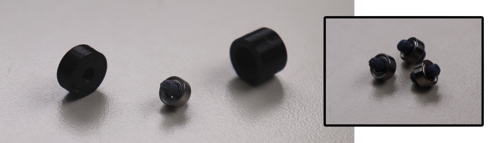

## Step 15: Insert roller bearings into the Top Piece

- Insert the roller bearings into the 3 holes in the top of the frame.
- Ensure the bearings are pressed all the way into the case.

  💡
  

    <strong>Tip:</strong> Needle nose pliers or some similar tool can be used to ensure that the bearing is fully seated.
  

  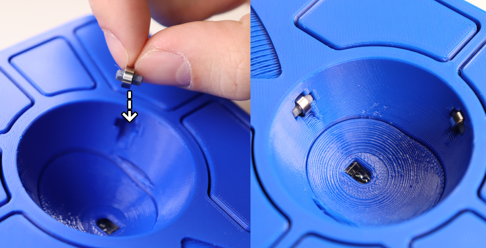

  🚨
  

    <strong>Warning:</strong> If the bearings aren't seated all the way, there's a good chance that the ball will become badly scratched.
  

## Step 16: Place Friction Pads on Base

- Flip the adept frame upside down.
- Place the friction pads on each corner of the frame.

  💡
  

    <strong>Tip:</strong> Do your best not to cover the screw holes with the friction pads, as this will make opening the case more difficult in the future.
  

  

## Step 17: Insert the ball

- Insert the track ball into the hole in the middle of the adept frame.

  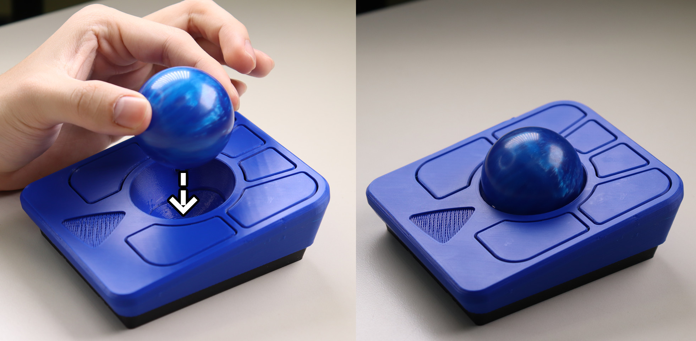

## Step 18: Peel and stick the logo to the Top

- Insert the logo in the indent on the top of the frame.

  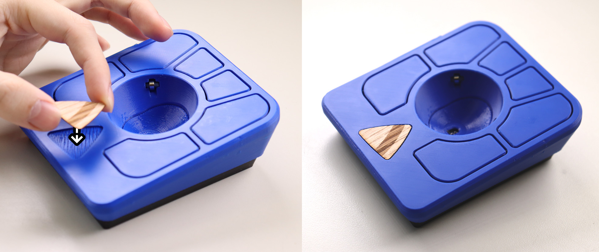

## Step 19: All done!

  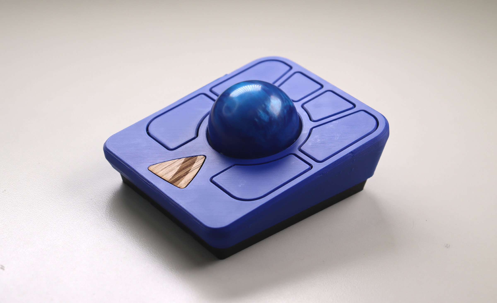

## Post Steps:

### Spin the ball to break in the bearings
- Spin the ball around for around 3 minutes to break them initially before any use
- The bearings may take around a week to become fully broken-in/smooth

### Verify the Ploopy Adept Trackball is working correctly
- Plug the adept trackball mouse into the computer using a USB-C cable
- Move the ball around, it should move the cursor

### Check out Post Build FAQ
- [Post Build FAQ](https://help.ploopy.co/?docs=where-can-i-find-mods-for-my-ploopy-device)
- Contains various information about things you can do after initial assembly!

  ℹ️
  

    <strong>Info:</strong> If the trackball is not working, consult our
    <a href="https://help.ploopy.co/checklist-v2/" style="color: #004085; font-weight: bold; text-decoration: underline;">troubleshooting guide</a>
    for further steps.
  

